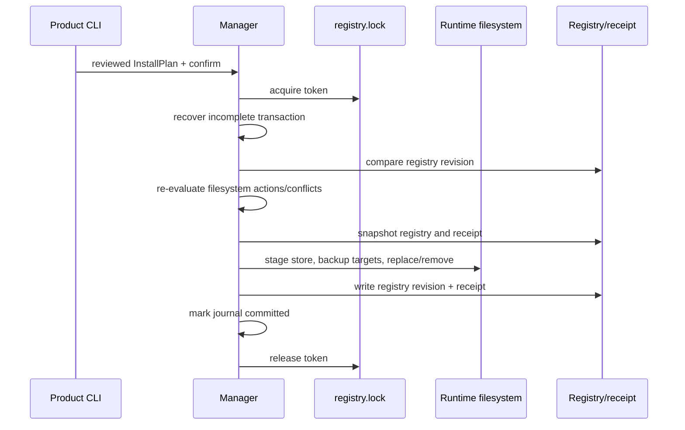

# 架构与状态模型

## Owner 边界

`agent-skills-runtime` 是机械共享层。它接收产品已经下载并验证身份的本地 bundle，
负责内容 digest、runtime 路径、共享 claims、事务和离线 catalog primitive。它不访问
GitHub、不决定 bundle 内容、不运行 Skill，也不选择产品命令。

产品 adapter 负责：

- 将运行中的 CLI version 绑定到 exact product install manifest；
- 下载并校验 release assets；
- 决定 entry/dependency、maturity、keywords、default prompt 和外部产品引用；
- 将共享结果投影为自身 summary、`--agent`、`--json` 或 update/setup 行为。

## 用户级状态

```text
~/.yeisme/agent-skills/
├── registry.json
├── registry.lock/
│   └── owner.json
├── store/sha256/<skill-tree-digest>/
└── transactions/<transaction-id>/
    ├── journal.json
    ├── registry-before.json
    ├── receipt-before.json
    ├── staging/
    └── backups/

~/.<product>/agent-skills.lock.json
```

`registry.lock` 是原子创建的目录而不是 advisory lock file，因此 Windows、Linux 和
macOS 使用同一实现。未知活锁不会被立即删除；超过 stale window 后先原子移动到带
唯一后缀的 evidence path，旧 owner 在继续提交前必须再次验证 token。

## Claim 与文件状态

一个 registry entry 由 `runtime + canonical skills_dir + skill` 唯一标识，并记录一个
Skill tree digest、精确文件清单和零到多个 product claims。

- 相同 digest：可增加 claim，不复制 runtime bytes。
- 不同 digest且仍有其他 product claim：`AGENT_SKILLS_DIGEST_CONFLICT`。
- unmanaged target：`AGENT_SKILLS_UNMANAGED_CONFLICT`，即使 bytes 恰好相同。
- user drift：保留目录；replace 需要显式 reviewed option。
- 最后一个 claim 被释放且 bytes 未改变：删除目录与 registry entry。
- 最后一个 claim 被释放但 bytes drift：保留零 claim orphan entry，防止后续静默覆盖。

## Transaction



plan 记录 base registry revision。Apply 在 lock 内重读 registry，并要求 revision 与
actions/conflicts 都仍与已审阅计划相同；否则返回 `AGENT_SKILLS_PLAN_STALE`。

进程内错误会立即按 journal 逆序恢复 runtime、registry 和 product receipt。进程崩溃
后，下一次 mutation 在持锁状态下恢复未完成 transaction。若失败目标在崩溃后又被
用户修改，自动恢复 fail closed 并保留 evidence，不覆盖新修改。

## 路径安全

bundle 只接受普通、非 executable 文件：

```text
SKILL.md
agents/openai.yaml
references/**
assets/**
```

绝对路径、反斜杠路径、`..`、symlink、device、undeclared file 和 allowlist 外路径均
被拒绝。Runtime path 在 plan 与 apply 时解析现有 symlink prefix；默认必须位于用户
HOME，下列场景可由 caller 显式增加 allowed root：`CODEX_HOME` 位于 HOME 外部。

## 并发和性能

首版使用一个 user-global lock。产品 Skills mutation 是低频、短事务，单锁比 per-path
lock 更容易证明 rollback 正确。若真实测量显示 contention，再在保持 registry revision
和 target ownership 不变量的前提下评估分片锁。

