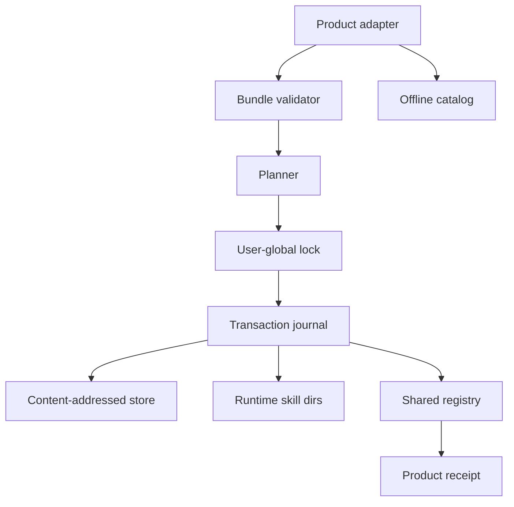

## Context

runtime 目录是共享可变状态；bundle 是不可信压缩包展开后的输入；registry 和文件
必须在并发产品进程、崩溃和用户手工修改下保持可恢复。最小可维护方案是纯 Go
library、单 user-global lock、JSON revision CAS 与 content-addressed store。

## Architecture

导出 API 分为 `bundle`、`catalog`、`runtime`、`manager` 四个概念，但首版保持一个
root package，避免未证明的 interface/factory。Product adapter 提供 product/version、
bundle root、runtimes 和 product receipt root；library 不下载资产。

## State and transaction rules

- `registry.json` 带 monotonic `revision`。plan 记录 base revision；apply 在 lock 内
  重读并 CAS，revision 不同返回 `AGENT_SKILLS_PLAN_STALE`。
- `registry.lock` 使用原子目录创建，记录 owner metadata；超时返回 typed busy，
  不自动删除未知活锁。
- 每次 mutation 先写 `transactions/<id>/journal.json` 与 staging；完成 runtime、
  registry、receipt 后标记 committed。失败保留 journal 与 backup 供下一次 doctor。
- runtime 目标通过逐 Skill 目录替换；registry 与 receipt 使用 temp + fsync + rename。
- bundle path 拒绝 traversal、absolute、symlink、device 与 allowlist 外内容。

## Catalog ranking

search/suggest 对 normalized name、display name、description、keywords 和 default prompt
进行确定性 token match；exact/name/keyword/description 权重固定，最终以 score desc、
name asc 排序。suggest 只返回 installed-compatible entries，最多三项，不执行任何命令。

## Compatibility

所有 v1 schema 均为 additive JSON objects。Reader 忽略未知 optional fields，拒绝未知
major schema。legacy adoption 只能由 consumer 将已验证 managed file inventory 传入，
library 不猜测 legacy state。

## Rollback

每个 committed transaction 保存 previous product claim set。Rollback 生成新 plan，
再次执行冲突/drift/CAS 检查。若文件已 drift，保留用户文件并返回 partial。

